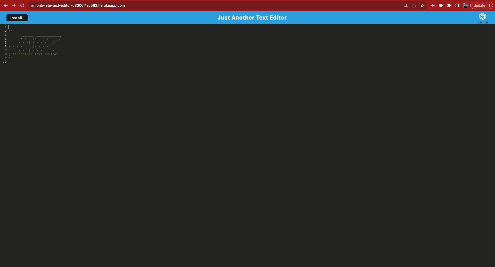
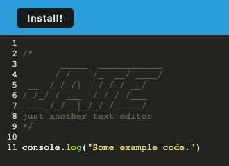
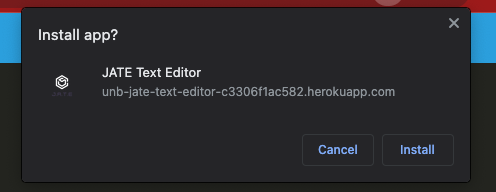
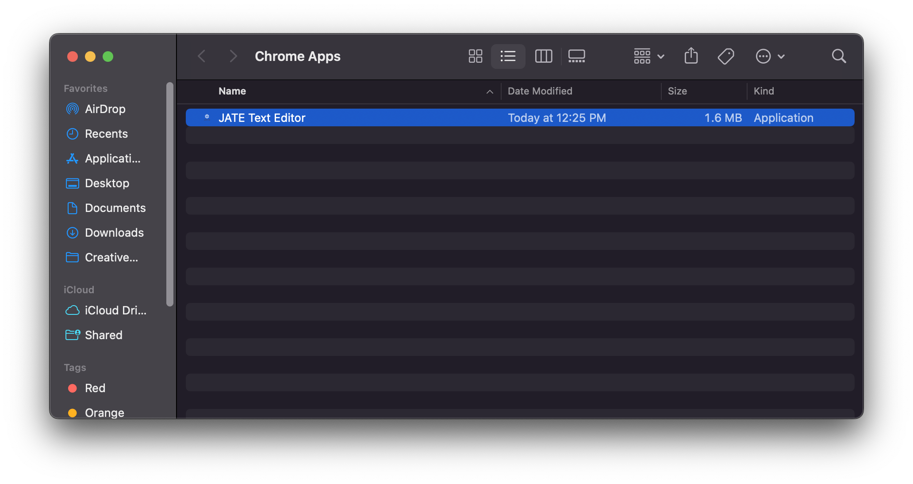

# JATE Text Editor

## Description

The JATE Text Editor application is a progressive web app that runs a text editor in the browser. This `Node.js` app uses express, babel, webpack, and webpack pluggins to run a text editor in the browser that cahces content and functions offline. It can also be installed and downloaded to your computer. The app is hosted on Heroku here: https://unb-jate-text-editor-c3306f1ac582.herokuapp.com/.

During the project, I learned a lot about service workers and caching, as well as gained experience building apps with webpack and using webpack pluggins.

## Table of Contents

- [Installation](#installation)
- [Usage](#usage)
- [Credits](#credits)
- [License](#license)

## Installation

To install the application, navigate to https://unb-jate-text-editor-c3306f1ac582.herokuapp.com/ and click the "Install" button, then click "Install" on the popup confirmation window. See the next section for more details.

To install the project, download the entire contents of this GitHub repo: https://github.com/stms15/PWA-text-editor and install required packages in each directory with `npm i`. Run `npm run start` from the root directory to start the application locally.

## Usage

You can access and use the web app here: https://unb-jate-text-editor-c3306f1ac582.herokuapp.com/.

When you load the website, you should see a page that looks like this.

Now you can just start typing! If you navigate away from the page, or click outside the window, the text you entered will be saved and will load when you open the window again.

<video src="./assets/videos/JATE-textSave.mov" alt="Video showing that text saves on close and loads on reopen" controls="controls"></video>

The app will also continue to work offline without an internet connection.

<video src="./assets/videos/JATE-offline.mov" alt="Video showing that text will continue to save when offline" controls="controls"></video>

If you want to download the app, click the "Install!" button in the top left of the screen.

You'll be prompted with a confirmation popup window. Click "Install" again to confirm.

The downloaded app should then open automatically and you should be able to find it in your "Chrome Apps" directory.

## Credits

This Stack Overflow thread was referenced to get the html file to reference the correct image when it's bundled and includes the hash in the filename: https://stackoverflow.com/questions/32753650/webpack-loading-images-from-html-templates.

## License

For more information about this license, please see the `LICENSE` file or visit https://spdx.org/licenses/MIT.html.

---

## Badges

